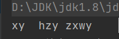
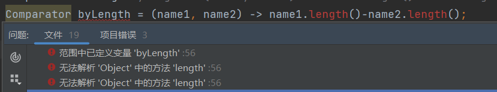

## Lambda语法概览

### 	lambda实现 Arrays void sort(Object[], Comparator<? super Object>)方法

​		按字符串长度比较

用匿名类实现

```java
    public void test01(){
        String[] names = {"hzy","xy","zxwy"};
        // 匿名内部类实现根据名字长短排序
        // void sort(Object[], Comparator<? super Object>)
        // 传入参数 和一个比较器
        Arrays.sort(names, new Comparator<String>() {
            @Override
            public int compare(String name1, String name2) {
                return name1.length()-name2.length();
            }
        });

        for (String name : names) {
            System.out.print(name+"\t");
        }
    }
```

 

```java
// 也可以这样写增强可读性
        Comparator<String> byLength = new Comparator<String>(){
            @Override
            public int compare(String name1, String name2) {
                return name1.length()-name2.length();
            }
        };

        Arrays.sort(names,byLength);
```

用Lambda实现

```java
Comparator<String> byLength = (String name1, String name2) -> name1.length()-name2.length();

/*
  public interface Comparator<T> {
     int compare(T o1, T o2);
    }
*/
  // 声明 Comparator<String> byLength 的时候就已经确定了参数的类型 所以Lambda表达式可以省略参数类型
  Comparator<String> byLength = (name1, name2) -> name1.length()-name2.length();
```

如果声明 Comparator byLength 的时候 未指定类型就会报错



### 方法参考(Method Reference)

