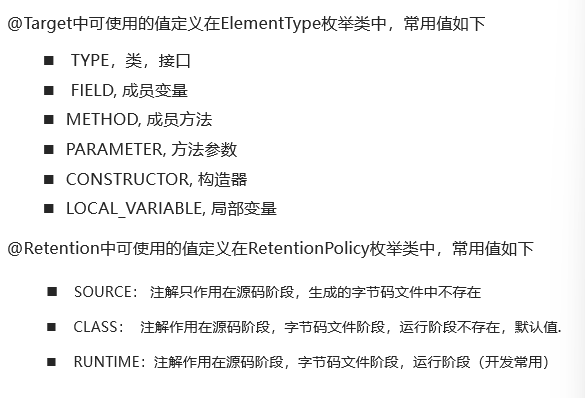
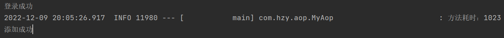
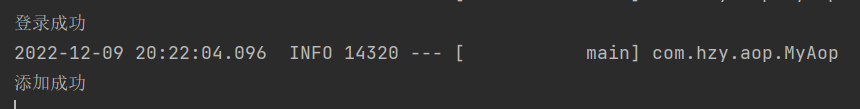
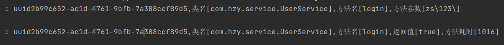

## 1.注解的作用

​	对Java中的类、方法、成员变量做标记、然后进行特殊处理

​	例如：JUnit框架中，标记了注解@Test的方法就可以被当作测试方法执行，而没有标记的就不能当成测试方法执行

## 2.自定义注解

```java
public @interface 注解名称{
    public 属性名称 属性名() default 默认值;
}
//例如
public @interface book{
    public String name() default "hzy";
    public String bookName();
}
//使用
//@book(bookName="java")
@book(name="zs",bookName="java")
public class a{
  
}
//特殊属性
//value属性，如果只有一个value属性的情况下，使用value属性的时候可以省略value名称不写!
//但是如果有多个属性,  且多个属性没有默认值，那么value名称是不能省略的
public @interface book2{
    public String name() default "hzy";
    public String value();
}
@book("aa")
public class b{
  
}
```

## 3.元注解

​	注解注解的注解

**元注解有两个：**

l **@Target**: 约束自定义注解只能在哪些地方使用，

 **@Retention**：申明注解的生命周期



## 4.springboot 实现一个注解完成方法耗时统计

### pom.xml依赖引入

```xml
		<!-- 引入aop
 			对自定义注解的特殊处理需要用到aop
		-->
		<dependency>
            <groupId>org.springframework.boot</groupId>
            <artifactId>spring-boot-starter-aop</artifactId>
        </dependency>
		<!-- 引入日志
 			打印信息
		-->
        <dependency>
            <groupId>org.projectlombok</groupId>
            <artifactId>lombok</artifactId>
        </dependency>
```

### 自定义注解

```java
@Target(ElementType.METHOD)//只允许注解在方法上面
@Retention(RetentionPolicy.RUNTIME)//注解在源码阶断，编译阶段，运行阶段都存在
public @interface MyLog {
}
```

### aop

```java
@Slf4j
@Aspect
@Component
public class MyAop {
   @Around("@annotation(myLog)")
    public Object around(ProceedingJoinPoint point, MyLog myLog) throws Throwable {
        long begin = System.currentTimeMillis();
        Object proceed = point.proceed();
        long end = System.currentTimeMillis();
        log.info("方法耗时："+(end-begin));
        return proceed;
    }
}
```

### 测试方法

```java
@Service
public class UserService {
   @MyLog
    public boolean login(String username,String password ){
        try {
            Thread.sleep(1000);
            System.out.println("登录成功");
            return true;
        } catch (InterruptedException e) {
            throw new RuntimeException(e);
        }
    }
    public void add(){
        try {
            Thread.sleep(1000);
            System.out.println("添加成功");
        } catch (InterruptedException e) {
            throw new RuntimeException(e);
        }
    }
}
```

### 测试

```java
@SpringBootTest
class CustomAnnotationApplicationTests {
    @Autowired
    UserService userService;

    @Test
    void contextLoads() {
        userService.login();
        userService.add();
    }

}
```



login方法上注解了MyLog所以打印了login 方法的耗时

add 方法 没有 注解所以没有


### 修改代码得到更详细的信息

```java
@Slf4j//日志
@Aspect//标记这是切面类
@Component//交给spring管理
public class MyAop {

    @Around("@annotation(myLog)")
    public Object around(ProceedingJoinPoint point, MyLog myLog) throws Throwable {
        //获取目标 class 对象  point.getTarget() 获取目标对象
        Class<?> aClass = point.getTarget().getClass();

        //获取类名
        String className = aClass.getName();

        //获取目标方法名称
        String methodName = point.getSignature().getName();

        //方法参数
        Object[] args = point.getArgs();
        StringBuffer stringBuffer = new StringBuffer();
        for (Object arg : args) {
            stringBuffer.append(arg).append("\\");
        }
        UUID uuid = UUID.randomUUID();
        log.info("uuid{},类名[{}],方法名[{}],方法参数[{}]",uuid,className,methodName,stringBuffer);
        long begin = System.currentTimeMillis();
        Object proceed = point.proceed();
        long end = System.currentTimeMillis();
        log.info("uuid{},类名[{}],方法名[{}],返回值[{}],方法耗[{}]",uuid,className,methodName,proceed,(end-begin));
        return proceed;
    }

}
```

日志打印时间----日志级别-----线程id--------线程名称-------执行的类名



日志信息

