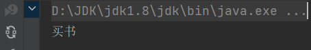
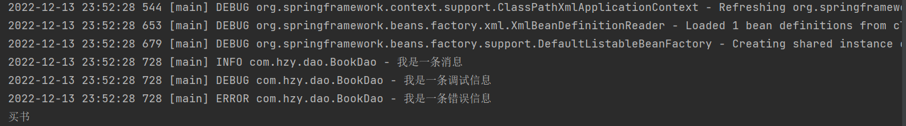
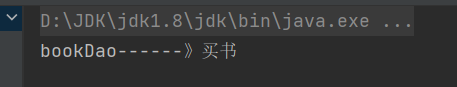
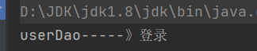
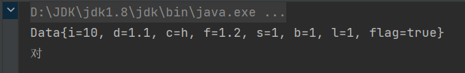
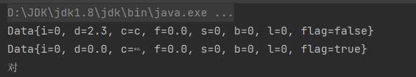
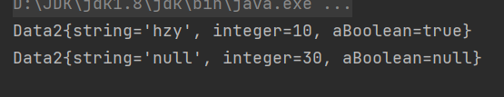
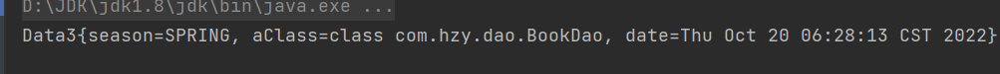

# Spring作业

## 1.自己能够独立的在不参考任何资料的前提下完成第一个Spring程序：能够实例化对象即可。

引入spring坐标、测试坐标

```xml
<dependencies>
        <dependency>
            <groupId>org.springframework</groupId>
            <artifactId>spring-context</artifactId>
            <version>5.2.10.RELEASE</version>
        </dependency>
        <dependency>
            <groupId>junit</groupId>
            <artifactId>junit</artifactId>
            <version>4.12</version>
            <scope>test</scope>
        </dependency>
    </dependencies>
```

定义bean

```java
public class BookDao {

    public void buy (){
        System.out.println("买书");
    }
}
```

编写spring配置文件

```xml
<?xml version="1.0" encoding="UTF-8"?>
<beans xmlns="http://www.springframework.org/schema/beans"
       xmlns:xsi="http://www.w3.org/2001/XMLSchema-instance"
       xsi:schemaLocation="http://www.springframework.org/schema/beans http://www.springframework.org/schema/beans/spring-beans.xsd">

    <!--
		id:随便写，给bean取的名字
		class:用来指定要创建的java对象的类名，这个类名必须是全限定类名（带包名）
	-->
    <bean id="bookDaoBean" class="org.example.dao.BookDao"></bean>
</beans>
```

编写测试程序

```java
@Test
    public void test01(){
        ClassPathXmlApplicationContext applicationContext =
                new ClassPathXmlApplicationContext("springConfig.xml");
        //"bookDaoBean"  写配置文件里面写的id
        BookDao bookDaoBean = (BookDao)applicationContext.getBean("bookDaoBean");
        bookDaoBean.buy();

    }
```

运行结果



补充

```java
    @Test
    public void test02(){
        ClassPathXmlApplicationContext applicationContext =
                new ClassPathXmlApplicationContext("springConfig.xml");
        //这样不需要强制类型转换
        BookDao bookDaoBean1 = 
            applicationContext.getBean("bookDaoBean", BookDao.class);
        //也可以直接根据类型获取bean
        BookDao bookDaoBean2 = applicationContext.getBean(BookDao.class);
        bookDaoBean1.buy();
        bookDaoBean2.buy();
    }
```


## 2.自己能够独立的将Spring6和Log4j2进行整合。（log4j2.xml文件内容可以拷贝）

引入log4j2坐标

```xml
<!--log4j2的依赖-->
        <dependency>
            <groupId>org.apache.logging.log4j</groupId>
            <artifactId>log4j-core</artifactId>
            <version>2.19.0</version>
        </dependency>
        <dependency>
            <groupId>org.apache.logging.log4j</groupId>
            <artifactId>log4j-slf4j2-impl</artifactId>
            <version>2.19.0</version>
        </dependency>
```

在BookDao使用日志

```java
public class BookDao {

    public void buy (){
        // 你自己怎么去使用log4j2记录日志信息呢？
        // 第一步：创建日志记录器对象
        // 获取FirstSpringTest类的日志记录器对象，也就是说只要是FirstSpringTest类中的代码执行记录日志的话，就输出相关的日志信息。
        Logger logger = LoggerFactory.getLogger(BookDao.class);

        // 第二步：记录日志，根据不同的级别来输出日志
        logger.info("我是一条消息");
        logger.debug("我是一条调试信息");
        logger.error("我是一条错误信息");
        System.out.println("买书");
    }
}
```

编写配置文件

```xml
<?xml version="1.0" encoding="UTF-8"?>
<configuration>
    <loggers>
        <!--
            level指定日志级别，从低到高的优先级：
                ALL < TRACE < DEBUG < INFO < WARN < ERROR < FATAL < OFF
        -->
        <root level="DEBUG">
            <appender-ref ref="spring6log"/>
        </root>
    </loggers>
    <appenders>
        <!--输出日志信息到控制台-->
        <console name="spring6log" target="SYSTEM_OUT">
            <!--控制日志输出的格式-->
            <PatternLayout pattern="%d{yyyy-MM-dd HH:mm:ss SSS} [%t] %-3level %logger{1024} - %msg%n"/>
        </console>
    </appenders>
</configuration>
```

```xml
<bean id="bookDaoBean" class="com.hzy.dao.BookDao"></bean>
```

编写测试程序

```java
public class test {
    @Test
    public void test01(){
        ApplicationContext applicationContext = new ClassPathXmlApplicationContext("springConfig.xml");
        BookDao bookDaoBean = applicationContext.getBean("bookDaoBean", BookDao.class);
        bookDaoBean.buy();
    }
}
```



## 3.自己能够独立的完成set注入。

编写配置文件

```xml
<bean id="bookDaoBean" class="com.hzy.dao.BookDao"></bean>
    <bean id="bookServiceBean" class="com.hzy.service.BookService">
        <!--property标签：设置注入属性-->
        <!--name属性：设置注入的属性名，实际是set方法对应的名称-->
        <!--ref属性：设置注入引用类型bean的id或name-->
        <property name="bookDao" ref="bookDaoBean"/>
    </bean>
```

编写BookDao和BookService

```java
public class BookDao {

    public void buy(){
        System.out.println("bookDao------》买书");
    }
}

public class BookService {
    BookDao bookDao;
	//基于set方法注入需要有set方法
    public void setBookDao(BookDao bookDao) {
        this.bookDao = bookDao;
    }
    public void buy(){
        bookDao.buy();
    }
}

```

编写测试程序

```java
@Test
    public void setTest(){
        ApplicationContext applicationContext =
                new ClassPathXmlApplicationContext("springConfig.xml");
        BookService bookServiceBean =
                applicationContext.getBean("bookServiceBean", BookService.class);
        bookServiceBean.buy();
    }
```



## 4.自己能够独立的完成构造注入。

编写配置文件

```xml
<bean id="userDaoBean" class="com.hzy.dao.UserDao"></bean>
    <bean id="userServiceBean" class="com.hzy.service.UserService">
        <!--根据构造方法参数类型注入-->
        <constructor-arg name="userDao" ref="userDaoBean"/>
    </bean>
```

编写UserDao和UserService

```java
public class UserDao {

    public void login(){
        System.out.println("userDao-----》登录");
    }
}

public class UserService {
    UserDao userDao;

    //
    public UserService(UserDao userDao) {
        this.userDao = userDao;
    }

    public void login(){
        userDao.login();

    }
}
```

编写测试程序

```java
@Test
    public void newTest(){
        ApplicationContext applicationContext =
                new ClassPathXmlApplicationContext("springConfig.xml");
        UserService userServiceBean =
                applicationContext.getBean("userServiceBean", UserService.class);
        userServiceBean.login();
    }
```



## 5.自己能够独立的完成内部Bean注入。

编写配置文件

```xml
<bean id="bookServiceBean" class="com.hzy.service.BookService">
        <property name="bookDao">
            <bean class="com.hzy.dao.BookDao"/>
        </property>
    </bean>
```

编写测试文件

```java
@Test
    public void neiTest(){
        ApplicationContext applicationContext =
                new ClassPathXmlApplicationContext("springConfig2.xml");
        BookService bookServiceBean =
                applicationContext.getBean("bookServiceBean", BookService.class);
        bookServiceBean.buy();
    }
```


## 6.自己能够独立的完成简单类型注入，包括：8种基本数据类型，8种包装类型，String类型，枚举类型，Class类型。

**8种基本类型的set注入:**

配置文件

```xml
 <bean id="dataBean" class="com.hzy.pojo.Data">
        <property name="b" value="1"/>
        <property name="i" value="10"/>
        <property name="d" value="1.1"/>
        <property name="f" value="1.2"/>
        <property name="c" value="h"/>
        <property name="s" value="1"/>
        <property name="l" value="1"/>
        <property name="flag" value="true"/>
    </bean>
```

编写Data类

```java
public class Data {
    int i;
    double d;
    char c;
    float f;
    short s;
    byte b;
    long l;
    boolean flag;
    //提供set方法 toString方法 太长就不贴在这里了
}
```

编写测试文件

```java
@Test
    public void jibengleixTest(){
        ApplicationContext applicationContext =
                new ClassPathXmlApplicationContext("springjibengleixing.xml");
        Data data =
                applicationContext.getBean("dataBean", Data.class);
        System.out.println(data);
        if (data.isFlag()){
            System.out.println("对");
        }else {
            System.out.println("不对");
        }
    }
```



**8种基本类型的构造方法注入:**

配置文件

```xml
<bean id="dataBean1" class="com.hzy.pojo.Data">
    //根据构造方法参数的下标注入
        <constructor-arg index="0" value="2.3"/>
        <constructor-arg index="1" value="c"/>
    </bean>
    <bean id="dataBean2" class="com.hzy.pojo.Data">
        //根据构造方法的名字注入
        <constructor-arg name="flag" value="true"/>
    </bean>
```

添加构造方法

```java
//无参构造方法也要写着 spring创建bean需要用到
public Data() {
    }
    public Data(boolean flag) {
        this.flag = flag;
    }
    public Data(double d, char c) {
        this.d = d;
        this.c = c;
    }
```

编程测试程序

```java
@Test
    public void jibengleixTest2(){
        ApplicationContext applicationContext =
                new ClassPathXmlApplicationContext("springjibengleixing2.xml");
        Data data1 =
                applicationContext.getBean("dataBean1", Data.class);
        System.out.println(data1);
        Data data2 =
                applicationContext.getBean("dataBean2", Data.class);
        System.out.println(data2);
        if (data2.isFlag()){
            System.out.println("对");
        }else {
            System.out.println("不对");
        }
    }
```



**8种包装类型:**(挑几个试一下就好了)和String

编写配置文件

```xml
<bean id="data2Bean1" class="com.hzy.pojo.Data2">
        <property name="aBoolean" value="true"/>
        <property name="integer" value="10"/>
        <property name="string" value="hzy"/>
    </bean>
    <bean id="data2Bean2" class="com.hzy.pojo.Data2">
        <constructor-arg name="integer" value="30"/>
    </bean>
```

编写Data2

```java
public class Data2 {
    String string;
    Integer integer;
    Boolean aBoolean;

    public Data2() {
    }

    public Data2(Integer integer) {
        this.integer = integer;
    }

    public void setInteger(Integer integer) {
        this.integer = integer;
    }

    public void setaBoolean(Boolean aBoolean) {
        this.aBoolean = aBoolean;
    }

    public Data2(String string) {
        this.string = string;
    }

    public void setString(String string) {
        this.string = string;
    }
}
```



注入枚举类型和Class类型和date类型

Data3

```java
public class Data3 {
  Season season;
    Class aClass;
    Date date;

    public void setDate(Date date) {
        this.date = date;
    }

    public void setSeason(Season season) {
        this.season = season;
    }

    public void setaClass(Class aClass) {
        this.aClass = aClass;
    }

    @Override
    public String toString() {
        return "Data3{" +
                "season=" + season +
                ", aClass=" + aClass +
                ", date=" + date +
                '}';
    }
}
```

配置文件

```xml
 <bean id="data3Bean" class="com.hzy.pojo.Data3">
        <property name="season" value="SPRING"/>
        <property name="aClass" value="com.hzy.dao.BookDao"/>
     	<!--报错了，说1970-10-11这个字符串无法转换成java.util.Date类型。-->
        <!--<property name="date" value="1970-10-11"/>-->
        <!--如果你硬要把Date当做简单类型的话，使用value赋值的话，这个日期字符串格式有要求-->
        <!--在实际开发中，我们一般不会把Date当做简单类型，
			虽然它是简单类型。一般会采用ref给Date类型的属性赋值。-->
        <property name="date" value="Wed Oct 19 16:28:13 CST 2022"/>
    </bean>
```

测试文件

```java
@Test
    public void meijuClassTest(){
        ApplicationContext applicationContext =
                new ClassPathXmlApplicationContext("meijuClass.xml");
        Data3 data3Bean = applicationContext.getBean("data3Bean", Data3.class);
        System.out.println(data3Bean);
    }
```




spring的简单类型判断：

```java
public static boolean isSimpleValueType(Class<?> type) {
		return (Void.class != type && void.class != type &&
				(ClassUtils.isPrimitiveOrWrapper(type) ||
				Enum.class.isAssignableFrom(type) ||
				CharSequence.class.isAssignableFrom(type) ||
				Number.class.isAssignableFrom(type) ||
				Date.class.isAssignableFrom(type) ||            
                 //java.util.Date是简单类型
				Temporal.class.isAssignableFrom(type) ||        
                 //Temporal是Java8提供的时间和时区类型
				URI.class == type ||
				URL.class == type ||
				Locale.class == type ||                         
                 //Locale是语言类，也是简单类型。
				Class.class == type));
	}
```


## 7.自己能够独立的完成数组注入，List注入，Set注入。

## 8.自己能够独立的完成Map集合注入，Properties注入。

## 9.自己能够独立的完成注入null和空字符串。

## 10.使用p命名空间注入和c命名空间注入。

## 11.使用util命名空间让配置复用。

## 12.编写出根据类型自动装配以及根据名字自动装配。

## 13.编写程序，让Spring能够引入外部独立的属性配置文件。

## 14.编写程序，测试scope的singleton和prototype有什么区别。

## 15.自己能够独立的编写出简单工厂模式的代码。

## 16.自己能够独立的编写出工厂方法模式的代码。

## 17.使用FactoryBean方式注入日期Date。

## 18.编写程序测试Spring获取Bean的四种方式。

## 19.编写程序测试Bean生命周期的七步。

## 20.自己能够独立的手写Spring框架的IoC容器。

## 21.自己能够独立的使用JdbcTemplate完成CRUD操作。

## 22.编写静态代理模式代码。

## 23.编写JDK动态代理。

## 24.编写CGLIB动态代理。

## 25.能够使用Spring+AspectJ的注解形式对项目中所有的service中所有的方法添加日志功能。

## 26.能够使用Spring+AspectJ的注解形式对项目中所有的service中所有的方法添加事务控制。

## 27.使用三层架构编写银行账户转账功能，然后引入Spring的事务支持来控制事务。

## 28.编写程序测试事务的传播行为。

## 29.编写程序测试事务的隔离级别。

## 30.自己能够独立的完成Spring6和MyBaits3.5.11的集成。